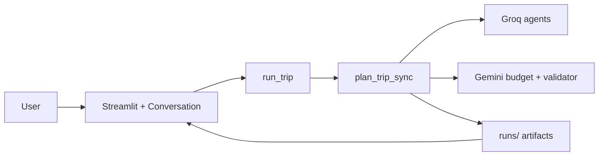

# Voice-Enabled Multi-Agent Travel Planner

[](https://www.python.org/downloads/)
[](https://streamlit.io/)
[](LICENSE)

**Voice-enabled multi-agent travel planner** built with **Groq**, **Gemini**, and **Streamlit**.  
Turn a spoken or typed trip request into a validated, day-by-day itinerary — with offline demo mode for portfolio walkthroughs.

<details>
<summary><strong>Table of contents</strong></summary>

- [Features](#features)
- [Screenshots](#screenshots)
- [Architecture overview](#architecture-overview)
- [Demo flow](#demo-flow)
- [Voice capabilities](#voice-capabilities)
- [Multi-agent pipeline](#multi-agent-pipeline)
- [Installation](#installation)
- [Quickstart](#quickstart)
- [Demo mode](#demo-mode-no-api-keys)
- [Deployment](#deployment)
- [Testing](#testing)
- [Limitations](#limitations)
- [Roadmap](#roadmap)
- [Documentation](#documentation)
- [Contributing](#contributing)

</details>

---

## Features

| Capability | Description |
|------------|-------------|
| **Voice & text copilot** | Streamlit UI with optional STT/TTS |
| **Smart slot filling** | Destination, duration, budget required before any LLM call |
| **Multi-agent pipeline** | Intent → parallel Groq specialists → Gemini budget → merge → validate |
| **Live progress** | Stages driven by real `trace.jsonl` during planning |
| **Rich itinerary UI** | Day cards, Morning/Afternoon/Evening, budget & logistics sidebars |
| **Demo mode** | Full sample Japan trip — zero API usage |
| **Exports** | Download Markdown or PDF |
| **CLI** | `plan-trip` for scripts and automation |

---

## Screenshots

Add PNGs under `docs/assets/` following [docs/assets/README.md](docs/assets/README.md), then uncomment below.

<!--


-->

| View | Asset file |
|------|------------|
| Homepage | `docs/assets/homepage.png` |
| Slot filling | `docs/assets/slot-filling.png` |
| Planning progress | `docs/assets/planning-progress.png` |
| Itinerary output | `docs/assets/itinerary-output.png` |
| Demo mode | `docs/assets/demo-mode.png` |

---

## Architecture overview

The **UI is additive** (`app/`). All planning goes through the existing coordinator:

`run_trip()` → `plan_trip_sync()` → specialist agents → artifacts in `runs/<run_id>/`.

**Full diagram:** [docs/assets/architecture-diagram.md](docs/assets/architecture-diagram.md)



**Not used:** LangGraph, `workflows/`, or alternate orchestration frameworks.

---

## Demo flow

1. **Launch** — `streamlit run app/voice_agent.py`
2. **Chat** — e.g. “5-day Tokyo Kyoto under $3000, love food”
3. **Checklist** — required slots turn green (✅)
4. **Generate** — pipeline runs (~30–60s) with staged progress
5. **Review** — day cards, validation, exports

**No API keys?** Sidebar → **Demo mode** → **Use demo itinerary**.

Scripted walkthrough: [docs/demo-script.md](docs/demo-script.md)

---

## Voice capabilities

| Feature | Library | Required? |
|---------|---------|-----------|
| Speech-to-text | `speechrecognition` (Google Web API) | Optional |
| Text-to-speech | `pyttsx3` | Optional |
| Text chat | built-in | Always available |

Install voice stack: `pip install -e ".[voice]"`  
Details: [docs/voice-agent.md](docs/voice-agent.md)

---

## Multi-agent pipeline

| Step | Agent | Provider |
|------|-------|----------|
| 1 | Intent parser | Groq |
| 2 | Destination, lodging, logistics (parallel) | Groq |
| 3 | Budget | Gemini |
| 4 | Merge itinerary | Groq |
| 5 | Validator (+ optional retry) | Gemini |

**Artifacts per run:** `00_request.txt` … `08_final_itinerary.md`, `trace.jsonl`

| Provider | Default model | ~calls / plan |
|----------|---------------|---------------|
| Groq | `llama-3.3-70b-versatile` | ~6 |
| Gemini | `gemini-3-flash` | ~2 |

Gemini free tier ≈ **20 RPD** → plan for ~10 full live runs/day. Use demo mode for recordings.

---

## Installation

**Requirements:** Python **3.9+**, `GROQ_API_KEY` + `GEMINI_API_KEY` for live planning only.

```bash
git clone <repo-url>
cd Multi\ Agent_Tokyo
python3 -m venv .venv
source .venv/bin/activate          # Windows: .venv\Scripts\activate
pip install -e ".[voice]"          # core + Streamlit + speech + PDF
cp .env.example .env               # add API keys for live runs
```

Optional dev dependencies:

```bash
pip install -e ".[dev,voice]"
```

---

## Quickstart

**Streamlit UI (recommended for demos):**

```bash
streamlit run app/voice_agent.py
```

**CLI:**

```bash
plan-trip "Plan a 5-day trip to Japan. Tokyo + Kyoto. \$3,000 budget. Love food and temples."
```

Output directory: `runs/<run_id>/`

---

## Demo mode (no API keys)

1. Open app sidebar  
2. Enable **Demo mode**  
3. Click **Use demo itinerary**

Loads [examples/canonical-japan/](examples/canonical-japan/) — no `plan_trip_sync`, Groq, or Gemini calls. Ideal for LinkedIn, interviews, and offline review.

---

## Deployment

| Method | Guide |
|--------|--------|
| Local | [docs/deployment.md](docs/deployment.md#local-setup) |
| Streamlit Cloud | [docs/deployment.md](docs/deployment.md#streamlit-cloud) |
| Docker | `docker build -t voice-travel-copilot .` then `docker run -p 8501:8501 --env-file .env voice-travel-copilot` |

Environment variables: see [.env.example](.env.example) and [docs/deployment.md](docs/deployment.md#environment-variables).

---

## Testing

```bash
# Safe — no API quota
pytest tests/test_voice_app.py tests/test_portfolio.py -q
pytest tests/test_schemas.py tests/test_client.py tests/test_pipeline_integration.py -q
pytest tests/test_acceptance.py -q
```

See [CONTRIBUTING.md](CONTRIBUTING.md) for quota guidance on live runs.

---

## Limitations

- UI slot filling is **rule-based** (not LLM-powered).
- Itinerary data is **LLM-only** (Phase 1) — not verified against live booking or map APIs.
- Streamlit suits demos; multi-user production needs a separate API layer.
- Voice STT requires network access to Google’s speech service.

---

## Roadmap

| Phase | Status | Focus |
|-------|--------|--------|
| Pipeline + voice UI | ✅ | Groq/Gemini agents, Streamlit copilot |
| Portfolio polish | ✅ | Demo mode, trace UI, Docker |
| **L+** | Planned | MCP live data, neighborhood KB |
| Production API | Future | FastAPI wrapper around `run_trip()` |

---

## Documentation

| Document | Audience |
|----------|----------|
| [project-summary.md](docs/project-summary.md) | Recruiters & interviews |
| [architecture.md](docs/architecture.md) | Technical design |
| [voice-agent.md](docs/voice-agent.md) | UI & conversation flow |
| [deployment.md](docs/deployment.md) | Ops & hosting |
| [demo-script.md](docs/demo-script.md) | 5-minute recording script |
| [implementation-plan.md](docs/implementation-plan.md) | Phases & data strategy |

---

## Contributing

Contributions welcome — please read [CONTRIBUTING.md](CONTRIBUTING.md).  
Released under the [MIT License](LICENSE).

---

## Golden example

Pre-generated Japan itinerary (also powers demo mode):

[examples/canonical-japan/08_final_itinerary.md](examples/canonical-japan/08_final_itinerary.md)
