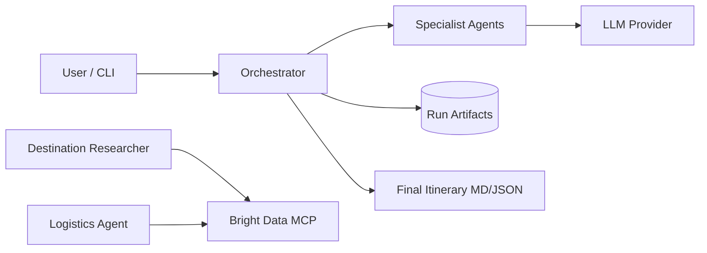
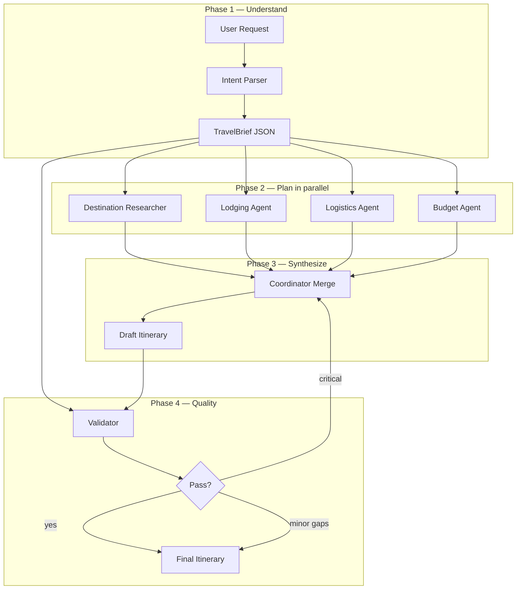
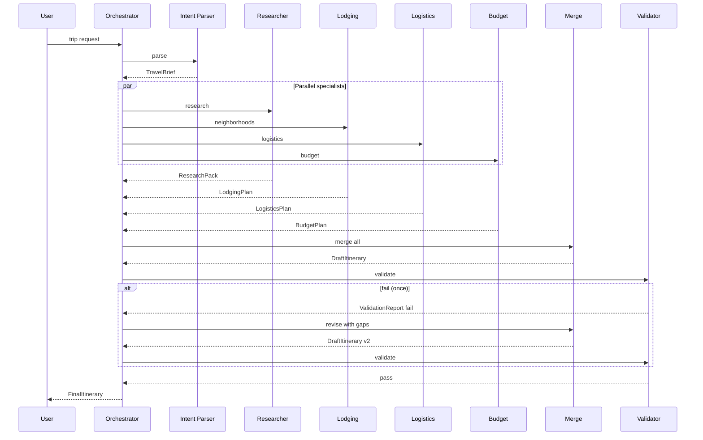

# Multi Agent_Tokyo — System Architecture

This document defines the technical architecture for the Travel Planning Multi-Agent System described in [problemstatement.md](./problemstatement.md). It is the implementation blueprint for agents, orchestration, data contracts, and tooling.

---

## 1. Architecture goals

| Goal | How the design supports it |
|------|----------------------------|
| Clear agent specialization | One role per concern; fixed input/output schemas |
| Observable handoffs | Every agent step logged with task id and artifact version |
| PM-friendly demo | Coordinator produces one markdown itinerary humans can read |
| Simple v1 runtime | Python orchestrator + LLM calls; optional Cursor Task subagents |
| Extensibility | New specialists plug in via registry without changing coordinator core |
| Safe research | Bright Data only on researcher/logistics; summarized context passed onward |

**Non-goals:** booking APIs, auth, multi-tenant scale, sub-second latency.

---

## 2. System context



| Actor | Responsibility |
|-------|----------------|
| **User** | Supplies natural-language trip request |
| **Orchestrator** | Runs pipeline, persists state, merges outputs |
| **Specialist agents** | Domain work with bounded prompts and schemas |
| **LLM** | Reasoning and prose per agent (same or per-role model) |
| **Bright Data MCP** | Search and scrape for fresh travel facts |
| **Artifact store** | Files per run: `runs/<id>/` |

---

## 3. High-level pattern: coordinator-led pipeline

v1 uses a **sequential pipeline with one parallel fan-out**, not a fully autonomous agent swarm. The coordinator (orchestrator) owns control flow; specialists do not message each other directly.



**Why pipeline + parallel fan-out**

- Easier to debug than peer-to-peer agent chat
- Satisfies acceptance criteria (≥3 specialists + coordinator + validator)
- `TravelBrief` is the stable contract all downstream agents share
- Parallel research/lodging/logistics/budget minimizes wall-clock time

**Retry policy:** Validator may request **one** coordinator revision if critical gaps (e.g. missing Kyoto days, budget ignored). No unbounded loops.

---

## 4. Component architecture

### 4.1 Orchestrator (`orchestrator/`)

Central runtime. Responsibilities:

1. Accept `TripRequest` (raw string + optional metadata)
2. Create `run_id`, initialize `RunState`
3. Invoke agents in order; enforce timeouts
4. Write artifacts after each step
5. Call merge + validator
6. Emit `FinalItinerary`

```text
orchestrator/
  __init__.py
  pipeline.py      # step graph, parallel execution
  run_state.py     # RunState dataclass + persistence
  merge.py         # coordinator merge logic (prompt + template fill)
  config.py        # env: model names, MCP flags, max retries
```

**Public API (Python)**

```python
def plan_trip(request: str, *, run_id: str | None = None) -> FinalItinerary:
    ...
```

CLI entry: `python -m orchestrator.cli "Plan a 5-day trip..."`

### 4.2 Agent framework (`agents/`)

Each agent implements a common interface:

```python
class Agent(Protocol):
    name: str

    def run(self, ctx: AgentContext) -> AgentResult:
        ...
```

| Field | Purpose |
|-------|---------|
| `AgentContext` | `run_id`, `travel_brief`, prior artifacts, tool access flags |
| `AgentResult` | `payload` (typed dict), `summary` (short markdown), `sources`, `warnings` |

```text
agents/
  base.py
  intent_parser.py
  destination_researcher.py
  lodging.py
  logistics.py
  budget.py
  validator.py
  prompts/           # one .md per agent
  tools/             # MCP wrappers
```

### 4.3 LLM layer (`llm/`)

Thin adapter so agents stay provider-agnostic.

```text
llm/
  client.py          # complete(), complete_json()
  schemas.py         # Pydantic models shared with agents
```

- **Intent parser** and **validator** use `complete_json()` with strict schema
- **Researcher** may use tools (MCP) in a ReAct-style loop capped at N steps
- **Merge** uses `complete()` with a large context window template

### 4.4 MCP tool gateway (`agents/tools/`)

Only **destination_researcher** and **logistics** get `tools_enabled=True`.

```text
agents/tools/
  brightdata.py      # search_engine, scrape_as_markdown
  research_cache.py  # disk cache keyed by query hash
  summarize.py       # shrink scrape results before AgentResult
```

Rules from problem statement:

- Cache or summarize before handoff
- Never pass raw HTML between agents
- Log queries and URLs in `sources[]`

Alpha Vantage is **out of v1 path** unless FX normalization is added later.

### 4.5 Artifacts & persistence (`runs/`)

```text
runs/
  <run_id>/
    00_request.txt
    01_travel_brief.json
    02_research.json
    03_lodging.json
    04_logistics.json
    05_budget.json
    06_draft_itinerary.md
    07_validation.json
    08_final_itinerary.md
    trace.jsonl          # step timestamps, token usage
```

Git-ignore `runs/` except committed **example** under `examples/canonical-japan/`.

---

## 5. Agent specifications

### 5.1 Intent parser

| Attribute | Value |
|-----------|--------|
| **Input** | Raw user string |
| **Output** | `TravelBrief` |
| **Tools** | None |
| **Model** | Fast, JSON-capable |

**Responsibilities**

- Extract duration, destinations, budget, preferences, anti-preferences
- Infer defaults (e.g. split 5 days → 3 Tokyo / 2 Kyoto if unstated)
- Flag ambiguities in `warnings[]`

### 5.2 Destination researcher

| Attribute | Value |
|-----------|--------|
| **Input** | `TravelBrief` |
| **Output** | `ResearchPack` |
| **Tools** | Bright Data search + scrape |
| **Model** | Capable reasoning + tool use |

**Responsibilities**

- Temples, food neighborhoods, iconic sights per city
- **Crowd-aware timing** (early morning temples, off-peak dining)
- Day-level activity candidates tagged `low_crowd | medium | high`

### 5.3 Lodging / neighborhoods

| Attribute | Value |
|-----------|--------|
| **Input** | `TravelBrief`, optional `ResearchPack.areas` |
| **Output** | `LodgingPlan` |
| **Tools** | None (v1); may add search later |
| **Model** | Same as default |

**Responsibilities**

- 2–3 neighborhoods per city with rationale vs food/temple prefs and budget
- Proximity to transit and day-one arrival

### 5.4 Logistics agent

| Attribute | Value |
|-----------|--------|
| **Input** | `TravelBrief` |
| **Output** | `LogisticsPlan` |
| **Tools** | Bright Data (routes, Shinkansen timing) |
| **Model** | Tool-capable |

**Responsibilities**

- Inter-city move (Tokyo ↔ Kyoto): mode, duration, approximate cost band
- Airport ↔ city if relevant
- Which **day** city switch occurs

### 5.5 Budget agent

| Attribute | Value |
|-----------|--------|
| **Input** | `TravelBrief`, `LogisticsPlan` cost hints |
| **Output** | `BudgetPlan` |
| **Tools** | None |
| **Model** | Default |

**Responsibilities**

- Split total budget: lodging, food, local transport, inter-city, activities, buffer
- Tradeoff notes if tight (e.g. fewer paid experiences)

### 5.6 Coordinator merge

| Attribute | Value |
|-----------|--------|
| **Input** | All specialist payloads + `TravelBrief` |
| **Output** | `DraftItinerary` (markdown sections) |
| **Tools** | None |
| **Model** | High-quality prose |

**Responsibilities**

- Build day-by-day schedule respecting city split and logistics day
- Weave food/temple/crowd preferences into narrative
- Align activities with `ResearchPack` and stays with `LodgingPlan`

Implemented in `orchestrator/merge.py` (deterministic section template + LLM fill).

### 5.7 Validator / critic

| Attribute | Value |
|-----------|--------|
| **Input** | `TravelBrief`, `DraftItinerary` |
| **Output** | `ValidationReport` |
| **Tools** | None |
| **Model** | JSON-capable |

**Responsibilities**

- Checklist against acceptance criteria (days, cities, budget, prefs)
- `status`: `pass | pass_with_gaps | fail`
- `gaps[]` with severity; trigger **one** merge retry on `fail`

---

## 6. Data contracts (inter-agent messages)

All cross-agent payloads are **JSON** (Pydantic), versioned with `schema_version: "1.0"`. Human-readable markdown is generated only at merge and final output.

### 6.1 `TravelBrief` (intent parser → everyone)

```json
{
  "schema_version": "1.0",
  "duration_days": 5,
  "destinations": [
    { "city": "Tokyo", "country": "Japan", "days": 3 },
    { "city": "Kyoto", "country": "Japan", "days": 2 }
  ],
  "budget": { "amount": 3000, "currency": "USD", "flexibility": "strict" },
  "preferences": ["food", "temples"],
  "anti_preferences": ["crowds"],
  "pace": "moderate",
  "party_size": 2,
  "notes": [],
  "warnings": ["Kyoto/Osaka day split not specified; assumed 2 Kyoto days"]
}
```

### 6.2 `ResearchPack`

```json
{
  "schema_version": "1.0",
  "cities": {
    "Tokyo": {
      "activities": [
        {
          "name": "Senso-ji",
          "type": "temple",
          "crowd_level": "high",
          "suggested_timing": "early_morning",
          "why": "Iconic temple; quieter before 8am"
        }
      ],
      "food_areas": ["Tsukiji Outer", "Shimokitazawa"]
    },
    "Kyoto": { }
  },
  "sources": [{ "url": "...", "title": "..." }]
}
```

### 6.3 `LodgingPlan`

```json
{
  "schema_version": "1.0",
  "cities": {
    "Tokyo": [
      {
        "neighborhood": "Asakusa",
        "pros": ["Temple proximity", "budget hotels"],
        "cons": ["Far from nightlife"],
        "fit_score": 0.85
      }
    ]
  }
}
```

### 6.4 `LogisticsPlan`

```json
{
  "schema_version": "1.0",
  "transfers": [
    {
      "from": "Tokyo",
      "to": "Kyoto",
      "day": 3,
      "mode": "Shinkansen",
      "duration_minutes": 150,
      "cost_estimate_usd": { "low": 100, "high": 140 },
      "notes": "Reserve seats; avoid peak Friday evening"
    }
  ],
  "sources": []
}
```

### 6.5 `BudgetPlan`

```json
{
  "schema_version": "1.0",
  "total": { "amount": 3000, "currency": "USD" },
  "categories": [
    { "name": "lodging", "amount": 900, "percent": 30 },
    { "name": "food", "amount": 750, "percent": 25 },
    { "name": "local_transport", "amount": 300, "percent": 10 },
    { "name": "intercity", "amount": 250, "percent": 8 },
    { "name": "activities", "amount": 500, "percent": 17 },
    { "name": "buffer", "amount": 300, "percent": 10 }
  ],
  "tradeoffs": ["If lodging exceeds $900, reduce paid experiences"]
}
```

### 6.6 `ValidationReport`

```json
{
  "schema_version": "1.0",
  "status": "pass_with_gaps",
  "checks": [
    { "id": "duration", "ok": true },
    { "id": "budget_discussed", "ok": true },
    { "id": "crowd_mitigation", "ok": true, "note": "Evening dining still busy" }
  ],
  "gaps": [
    { "severity": "low", "message": "No explicit temple day in Kyoto labeled" }
  ]
}
```

### 6.7 `FinalItinerary`

Markdown file matching the template in problemstatement.md, plus optional `final.json` mirror for programmatic use.

---

## 7. Control flow (sequence)



**Timeouts (defaults)**

| Step | Timeout |
|------|---------|
| Intent parse | 30s |
| Each parallel specialist | 120s |
| Merge | 90s |
| Validator | 30s |
| Full run | 8 min |

---

## 8. Prompt & context management

Each agent loads `agents/prompts/<agent_name>.md` with:

1. Role and boundaries (what not to do)
2. Output JSON schema excerpt
3. Examples for canonical Japan case

**Context budget rules**

| Agent | Max context from prior steps |
|-------|------------------------------|
| Intent | User request only |
| Specialists | `TravelBrief` + role-specific prior artifact only if needed |
| Merge | Summaries of all packs (not raw scrape) |
| Validator | `TravelBrief` + `DraftItinerary` |

Researcher internal loop: max **5** tool calls per run; scrape truncated to **4k tokens** per page before summarize.

---

## 9. Deployment & runtime options

### 9.1 Recommended v1: Python orchestrator

| Piece | Choice |
|-------|--------|
| Language | Python 3.11+ |
| Schemas | Pydantic v2 |
| Parallelism | `asyncio.gather` for phase 2 |
| LLM | OpenAI-compatible API (env `LLM_API_KEY`) |
| Config | `.env` + `config.py` |

Best for reproducible demos, artifact folders, and CI.

### 9.2 Alternative: Cursor-native execution

| Piece | Choice |
|-------|--------|
| Orchestration | Parent agent + Task subagents per specialist |
| Contracts | Paste `TravelBrief` JSON in subagent prompts |
| Artifacts | Manual save to `runs/` |

Use when avoiding a codebase; tradeoff is weaker automation and trace consistency.

### 9.3 Future: Cursor SDK

Same pipeline graph; `Agent.prompt()` per specialist. Defer until Python v1 is stable.

---

## 10. Repository layout (target)

```text
Multi Agent_Tokyo/
  docs/
    problemstatement.md
    architecture.md          # this file
  orchestrator/
  agents/
  llm/
  examples/
    canonical-japan/
      08_final_itinerary.md
  runs/                      # gitignored
  tests/
    test_intent_parser.py
    test_pipeline_integration.py
  pyproject.toml
  .env.example
  README.md
```

---

## 11. Security & reliability

| Topic | Approach |
|-------|----------|
| Secrets | API keys in `.env` only; never in prompts or commits |
| MCP | Rate-limit tool calls; no PII in search queries |
| Failures | Agent returns `warnings[]`; pipeline continues if non-critical |
| Partial research | Researcher documents uncertainty; merge must not invent prices |
| Idempotency | Same `run_id` + inputs → reproducible with cached MCP |

---

## 12. Observability

`trace.jsonl` per run — one JSON line per step:

```json
{
  "ts": "2026-05-20T12:00:00Z",
  "step": "destination_researcher",
  "duration_ms": 45000,
  "tokens_in": 1200,
  "tokens_out": 800,
  "tool_calls": 3,
  "status": "ok"
}
```

Optional: print human summary to CLI after `08_final_itinerary.md` is written.

---

## 13. Testing strategy

| Level | What |
|-------|------|
| **Unit** | Intent parser → `TravelBrief` for canonical string; validator checklist |
| **Contract** | JSON schema validation for each pack |
| **Integration** | Mock LLM + mock MCP → full pipeline → expected sections in markdown |
| **Golden** | Compare `examples/canonical-japan/` to new run (soft: LLM variance) |

Acceptance criteria from problemstatement.md map to integration test assertions.

---

## 14. Mapping to acceptance criteria

| Criterion | Architecture element |
|-----------|------------------------|
| Submit canonical request → plan | `plan_trip()` CLI |
| ≥3 specialist roles | Researcher, Lodging, Logistics, Budget (+ Intent, Validator) |
| Day-by-day, stays, logistics, budget | Merge template sections 1–5 |
| Food, temples, crowd avoidance | `TravelBrief` drives researcher + merge prompts; validator checks |
| Validation step | `Validator` → `ValidationReport` appended to final MD |

---

## 15. Evolution roadmap

| Phase | Enhancement |
|-------|-------------|
| v1.0 | Python pipeline, Bright Data on researcher + logistics, markdown output |
| v1.1 | Lodging agent web search; FX via Alpha Vantage optional |
| v1.2 | User-editable `TravelBrief` before phase 2 |
| v2.0 | Dynamic city support; subgraph per country; SDK deployment |

---

## 16. Open decisions (resolved for v1)

| Question (from problem statement) | v1 decision |
|----------------------------------|-------------|
| Runtime | Python orchestrator primary; Cursor Tasks optional |
| Message format | JSON packs between agents; markdown at merge/final |
| City scope | Canonical Japan demo first; parser supports arbitrary cities if LLM generalizes |

---

## Revision log

| Date | Change |
|------|--------|
| 2026-05-20 | Initial architecture from problemstatement.md |
