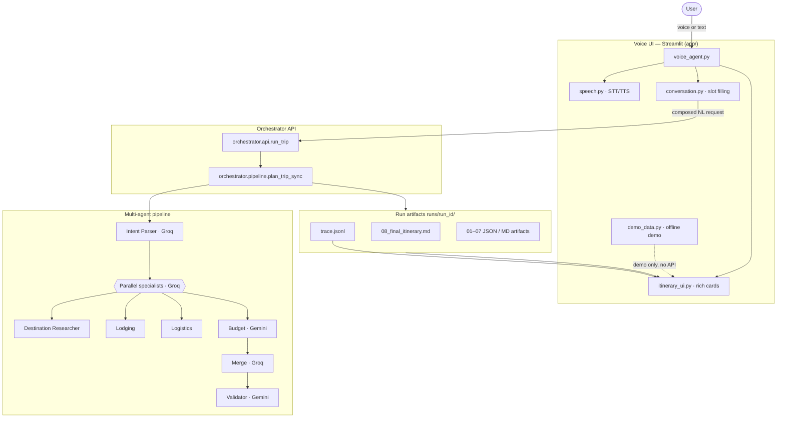

# System Architecture Diagram

Canonical diagram for README, portfolios, and submissions.  
Render on GitHub or any Mermaid-compatible viewer.

---

## End-to-end flow

---

## Layer responsibilities

| Layer | Location | Role |
|-------|----------|------|
| Voice UI | `app/voice_agent.py` | Chat, slots, generate, exports |
| Conversation | `app/conversation.py` | Rule-based slot filling before API |
| API wrapper | `orchestrator/api.py` | `run_trip()` → `plan_trip_sync()` |
| Pipeline | `orchestrator/pipeline.py` | Coordinator sequence, no LangGraph |
| Agents | `agents/*` | Specialist LLM calls + prompts |
| Schemas | `llm/schemas.py` | Pydantic contracts between steps |

---

## What is intentionally excluded

- LangGraph / `graph.invoke()`
- `workflows/` orchestration packages
- Live Places/Booking APIs (Phase L+ in [implementation-plan.md](../implementation-plan.md))

---

## Related docs

- [architecture.md](../architecture.md) — detailed component design
- [voice-agent.md](../voice-agent.md) — UI behavior
- [deployment.md](../deployment.md) — run & deploy
