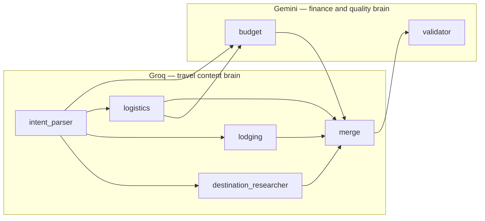
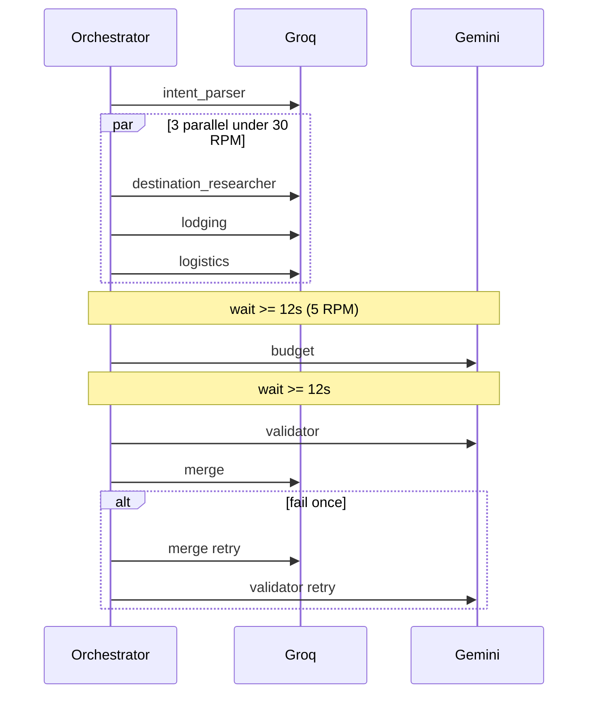
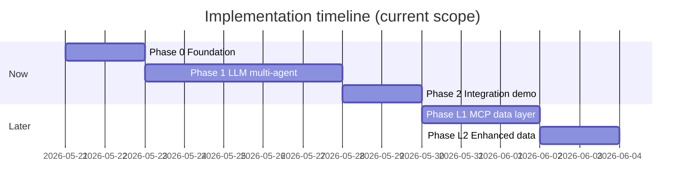
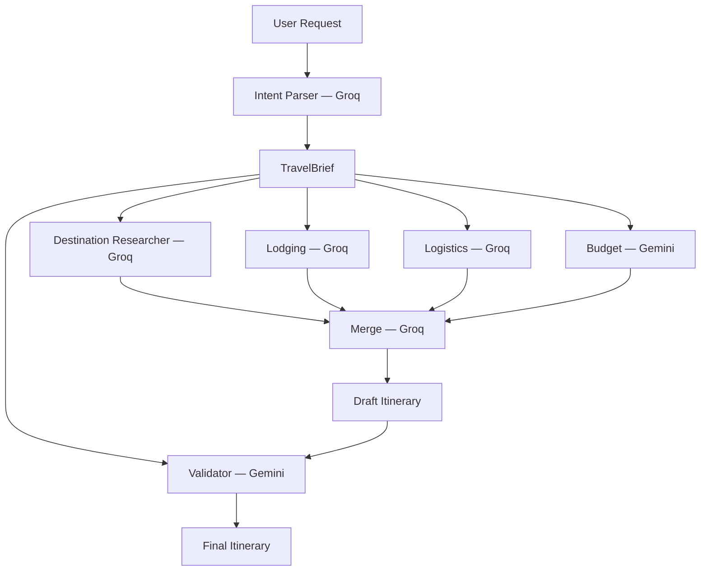
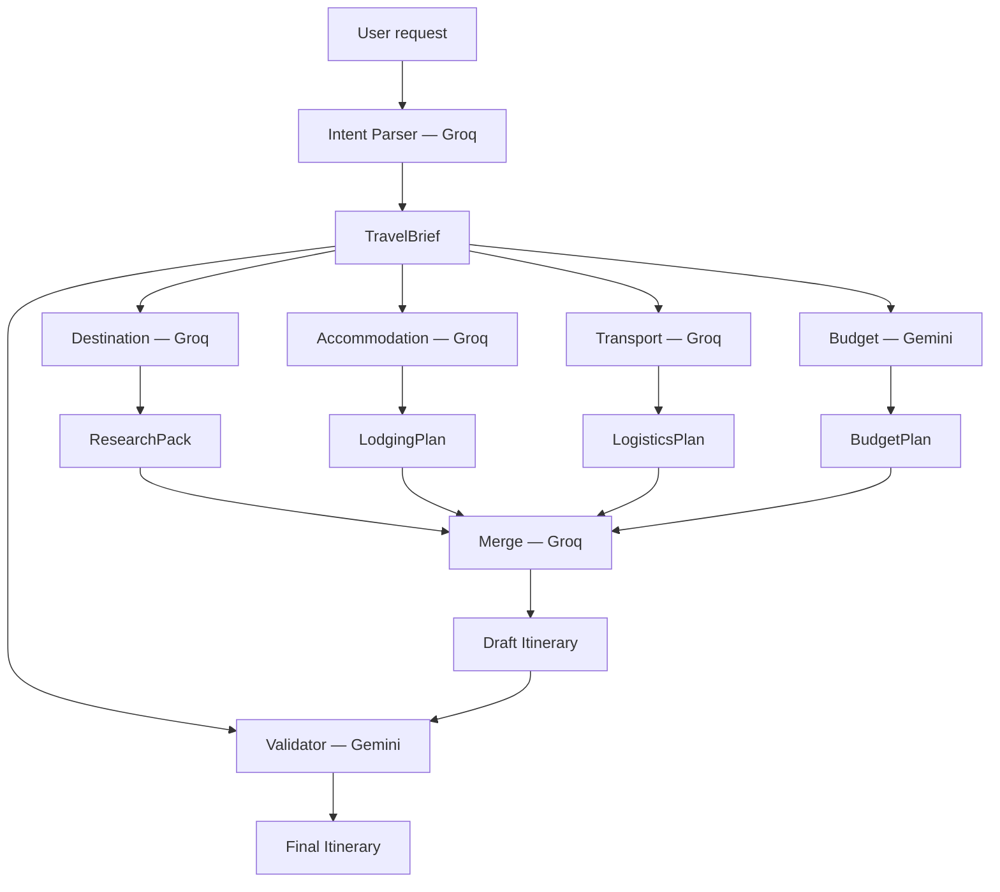
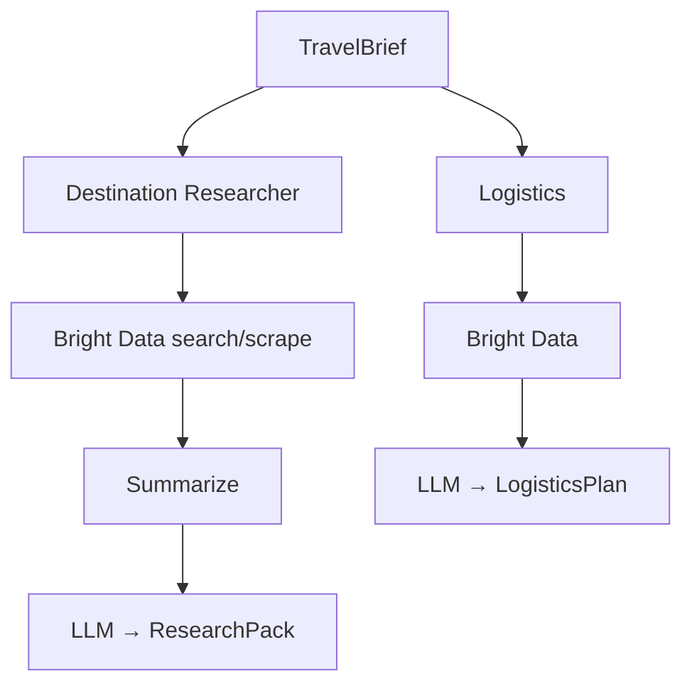

# Multi Agent_Tokyo — Phase-Wise Implementation Plan

This plan translates [problemstatement.md](./problemstatement.md) and [architecture.md](./architecture.md) into executable phases. Each phase lists goals, tasks, deliverables, and exit criteria.

**Canonical demo request (use for all phases):**

> Plan a 5-day trip to Japan. Tokyo + Kyoto. $3,000 budget. Love food and temples, hate crowds.

---

## Implementation strategy (current vs later)

| Scope | Approach | When |
|-------|----------|------|
| **Now — Phase 1** | **Fully LLM-driven** multi-agent pipeline (**Groq + Gemini**) | Research/lodging/logistics on **Groq**; budget/validator on **Gemini**; no MCP/KB yet |
| **Later — Phase L+** | Live web (Bright Data MCP), static neighborhood KB, FX APIs, caching | After Phase 1 demo meets acceptance criteria |

**Why LLM-first**

- Fastest path to a working multi-agent demo (orchestration, handoffs, final itinerary)
- Matches problem statement non-goals (no live bookings, no guaranteed prices)
- Any city (Tokyo, Jaipur, etc.) works via `TravelBrief` without region-specific integrations
- MCP/KB layers plug in later without changing agent contracts (`ResearchPack`, `LodgingPlan`, etc.)

Every LLM-generated pack must set `data_confidence: "inferred"` (or `"typical"` for rule-based budget splits) and include `warnings[]` such as `"Plan based on model knowledge; not verified against live sources"`.

---

## Two-brain LLM routing (Groq + Gemini)

Phase 1 uses **two providers** so specialists do not all share one model bias. Travel **content** agents (research, stays, moves) run on **Groq**; **financial and quality** agents run on **Gemini**.

| Brain | Provider | Agents | Rationale |
|-------|----------|--------|-----------|
| **Travel content** | **Groq** | `destination_researcher`, `lodging`, `logistics` | Fast inference; strong at factual travel lists, areas, routes |
| **Finance & quality** | **Gemini** | `budget`, `validator` | Second model cross-checks numbers, constraints, and acceptance criteria |
| **Orchestration** | Groq *(default)* | `intent_parser`, `merge` | Structured extract + narrative merge from Groq specialist outputs; override per env if needed |



### Environment variables

```bash
# Groq (research, accommodation, transport + default intent/merge)
GROQ_API_KEY=
GROQ_MODEL=llama-3.3-70b-versatile    # example; set in config

# Gemini (budget, validator)
GEMINI_API_KEY=
GEMINI_MODEL=gemini-3-flash            # Gemini 3 Flash; 5 RPM / 20 RPD tier

DATA_MODE=llm_only
```

### Implementation notes

| Item | Detail |
|------|--------|
| **Client** | `llm/client.py` — `get_client(provider: "groq" \| "gemini")`; each agent declares `provider` in `agents/base.py` or config map |
| **Trace** | `trace.jsonl` logs `provider` + `model` per step (required for demo/debug) |
| **Handoffs** | Unchanged — JSON packs only; provider boundary is invisible to downstream agents |
| **Failure** | If one provider is down, fail that step with clear error (no silent cross-provider fallback in Phase 1) |
| **Phase L1** | MCP tools attach to Groq agents (destination, logistics) only; Gemini agents stay tool-free |

**Why two brains**

- Reduces single-model blind spots (e.g. Groq omits budget tradeoff → Gemini validator can flag)
- Makes multi-agent story visible to PMs: “research brain” vs “checks and money brain”
- Keeps contracts stable when swapping models via env

### Provider rate limits (account quota)

Phase 1 **must** schedule LLM calls within these limits (see `orchestrator/rate_limits.py`, `llm/rate_limiter.py`).

#### Groq — `llama-3.3-70b-versatile`

| Limit | Quota | Phase 1 implication |
|-------|-------|---------------------|
| **RPM** | 30 | Up to 3 Groq specialists in parallel is OK; ~6 calls/run ≪ 30/min |
| **RPD** | 1,000 | ~166 full runs/day at 6 Groq calls each |
| **TPM** | 12,000 | **Tight** — keep prompts + JSON packs short; summarize before merge |
| **TPD** | 100,000 | Prefer compact `ResearchPack`; avoid huge markdown in Groq context |

#### Gemini — `gemini-3-flash`

| Limit | Quota | Phase 1 implication |
|-------|-------|---------------------|
| **RPM** | 5 | **Never** call budget + validator in parallel; ≥12s between Gemini calls |
| **TPM** | 250,000 | Generous — budget/validator can receive fuller context |
| **RPD** | 20 | **~10 full runs/day** (2 Gemini calls/run); cache runs; avoid dev retry loops |

#### LLM calls per pipeline run

| Provider | Agent steps | Calls (typical) | Calls (max, 1 merge retry) |
|----------|-------------|-----------------|----------------------------|
| Groq | intent → 3 specialists ∥ → merge | **6** | **7** |
| Gemini | budget → validator | **2** | **3** |

#### Phase 1 orchestration rules (required)

1. **Groq:** `asyncio.gather` only for `destination_researcher`, `lodging`, `logistics` (max 3 concurrent).
2. **Gemini:** run `budget` then `validator` **sequentially**; call `ProviderRateLimiter.acquire("gemini")` before each.
3. **Spacing:** enforce `min_seconds_between_requests` from limits (~12.5s for Gemini @ 5 RPM).
4. **Daily cap:** track RPD in `runs/.quota/`; fail fast with clear error when Gemini 20/day exceeded.
5. **Tokens:** target &lt;4k tokens per Groq request where possible (12K TPM shared across parallel calls in same minute).
6. **Retries:** at most **one** merge retry (already planned) — saves Gemini RPD.
7. **Dev/CI:** use mock `completion_fn` in tests; reserve live Gemini quota for demo runs.



#### Config / env overrides

```bash
RATE_LIMIT_ENABLED=true
# GROQ_RPM=30  GROQ_TPM=12000  GROQ_RPD=1000  GROQ_TPD=100000
# GEMINI_RPM=5  GEMINI_TPM=250000  GEMINI_RPD=20
```

---

## Overview

| Phase | Name | Duration (est.) | Outcome |
|-------|------|-----------------|--------|
| **0** | Foundation & contracts | 1–2 days | Repo scaffold, Pydantic schemas, LLM client |
| **1** | **Fully LLM-driven multi-agent system** | 4–6 days | End-to-end pipeline: intent → specialists → merge → validate |
| **2** | Integration & demo | 1–2 days | E2E tests, golden example, README |
| **L1** *(deferred)* | Data layer (MCP / Bright Data) | 2–3 days | Search, scrape, cache, summarize for destination + transport |
| **L2** *(deferred)* | Enhanced data sources | 1–2 days | Static neighborhood KB, lodging web search, FX |
| **L3** *(deferred)* | UX polish | 1 day | Editable `TravelBrief`, streaming CLI |

**Total Phase 0–2 estimate:** ~6–10 working days for one developer.



---

## Phase 0 — Foundation & contracts

### Goals

- Runnable Python package with env-based config
- Shared data models matching architecture §6
- LLM adapter with JSON mode

### Tasks

| # | Task |
|---|------|
| 0.1 | Add `pyproject.toml`, `README.md`, `.env.example`, `.gitignore` (`runs/`, `.env`) |
| 0.2 | Implement `llm/schemas.py` — `TravelBrief`, `ResearchPack`, `LodgingPlan`, `LogisticsPlan`, `BudgetPlan`, `ValidationReport` |
| 0.3 | Implement `llm/client.py` — `complete()`, `complete_json()` with **Groq** and **Gemini** adapters |
| 0.4 | Add `orchestrator/config.py` — `AGENT_PROVIDERS` map, model IDs, timeouts; **`DATA_MODE=llm_only`** |
| 0.5 | Stub `agents/base.py` — `AgentContext`, `AgentResult`, `Agent` protocol; optional `provider: groq \| gemini` per agent |
| 0.6 | `.env.example` — `GROQ_API_KEY`, `GEMINI_API_KEY`, `GROQ_MODEL`, `GEMINI_MODEL` |

### Deliverables

- `llm/schemas.py`, `llm/client.py`
- Unit test: schema round-trip for sample JSON fixtures

### Exit criteria

- [ ] `pip install -e .` succeeds
- [ ] `complete_json()` returns valid `TravelBrief` from mocked Groq and Gemini responses
- [ ] All schema models validate architecture examples
- [ ] `AGENT_PROVIDERS` maps budget + validator → `gemini`; research + lodging + logistics → `groq`

---

## Phase 1 — Fully LLM-driven multi-agent system

### Goals

- Complete coordinator-led pipeline with **no external data fetchers**
- All seven agent roles produce architecture §6 JSON packs + final markdown
- Works for canonical Japan request and arbitrary cities (e.g. Jaipur) via prompts + `TravelBrief`

### Pipeline (Phase 1)



### Tasks

| # | Task | Notes |
|---|------|-------|
| **Orchestration** | | |
| 1.1 | `orchestrator/run_state.py` — artifacts under `runs/<run_id>/` | |
| 1.2 | `orchestrator/pipeline.py` — intent → parallel specialists → merge → validate | `asyncio.gather` for specialists |
| 1.3 | `orchestrator/merge.py` — **Groq** | section template + LLM → `06_draft_itinerary.md` |
| 1.4 | `orchestrator/cli.py` — `python -m orchestrator.cli "<request>"` | |
| 1.5 | `trace.jsonl` per step — log `provider`, `model` (no `tool_calls` in Phase 1) | |
| **Agents (LLM only, two providers)** | | |
| 1.6 | `agents/intent_parser.py` + prompt — **Groq** | → `01_travel_brief.json` |
| 1.7 | `agents/destination_researcher.py` + prompt — **Groq** | `complete_json()` → `02_research.json`; **no** ReAct/MCP |
| 1.8 | `agents/lodging.py` + prompt — **Groq** | → `03_lodging.json`; **no** static KB |
| 1.9 | `agents/logistics.py` + prompt — **Groq** | → `04_logistics.json`; typical cost bands from Groq |
| 1.10 | `agents/budget.py` + prompt — **Gemini** | reads `TravelBrief` + `LogisticsPlan`; → `05_budget.json` |
| 1.11 | `agents/validator.py` + prompt — **Gemini** | → `07_validation.json`; one merge retry on `fail` |
| 1.12 | Append validation to `08_final_itinerary.md` | |
| **Prompts & quality** | | |
| 1.13 | All prompts include: role, schema excerpt, canonical Japan example, `data_confidence` rules | |
| 1.14 | Every pack sets `warnings[]` with LLM-only disclaimer | |
| 1.15 | `sources[]` empty or omitted in Phase 1 (populated in Phase L1) | |
| 1.16 | Wire `llm/rate_limiter.py` in pipeline; Gemini sequential; log quota in `trace.jsonl` | See rate limits § |
| 1.17 | Compact Groq prompts to respect **12K TPM** | Summaries in merge, not full packs |

### Deliverables

| Artifact | Path |
|----------|------|
| Full pipeline | `orchestrator/pipeline.py`, `plan_trip()` |
| Seven agents + prompts | `agents/*.py`, `agents/prompts/*.md` |
| Run artifacts | `00_request.txt` … `08_final_itinerary.md` |

### Exit criteria

- [ ] Canonical request completes end-to-end in &lt;5 min (LLM latency only)
- [ ] `01_travel_brief.json` — Tokyo 3d / Kyoto 2d, $3000, food/temples/crowds
- [ ] `02_research.json` — temples, food areas, `crowd_level` / `suggested_timing` per city
- [ ] `03_lodging.json` — 2–3 neighborhoods per city with pros/cons
- [ ] `04_logistics.json` — Tokyo→Kyoto transfer with day + cost band
- [ ] `05_budget.json` — categories sum to ~100% of budget
- [ ] `08_final_itinerary.md` — all template sections + validation block
- [ ] Non-Japan request (e.g. Jaipur) runs without code changes — only prompt/LLM output differs
- [ ] All packs include `data_confidence: "inferred"` (budget may use `"typical"` for template splits)
- [ ] `trace.jsonl` shows Groq for steps 1.6–1.9 + merge, Gemini for budget + validator

---

## Phase 2 — Integration & demo

### Goals

- Prove acceptance criteria with tests and a committed golden run
- Document LLM-only setup (`GROQ_API_KEY` + `GEMINI_API_KEY`, two-brain routing, no MCP)

### Tasks

| # | Task |
|---|------|
| 2.1 | `tests/test_intent_parser.py`, `tests/test_schemas.py` |
| 2.2 | `tests/test_pipeline_integration.py` — **mock LLM only** (no MCP mocks needed) |
| 2.3 | Live canonical run → `examples/canonical-japan/08_final_itinerary.md` |
| 2.4 | `README.md` — install, `.env`, CLI, **Groq + Gemini** agent map, Phase 1 = LLM-only |
| 2.5 | Check off acceptance criteria in problemstatement.md |

### Exit criteria

- [ ] All problem statement acceptance criteria met
- [ ] `trace.jsonl` shows ≥6 steps (intent, 4 specialists, merge, validate)
- [ ] README states deferred items: MCP, KB, FX (Phase L+)

---

## Deferred phases (later — not in current scope)

### Phase L1 — Data layer (MCP / Bright Data)

*Previously outlined as “Phase 2” in the original plan.*

| # | Task |
|---|------|
| L1.1 | `agents/tools/brightdata.py` — `search()`, `scrape_markdown()` |
| L1.2 | `agents/tools/research_cache.py`, `summarize.py`, `query_builder.py` |
| L1.3 | Wire MCP into `destination_researcher` (ReAct, max 5 calls) and `logistics` (max 3 calls) |
| L1.4 | Set `DATA_MODE=mcp_enhanced`; populate `sources[]`; upgrade `data_confidence` to `verified` when scraped |
| L1.5 | `config.py`: `MCP_ENABLED=true` |

**Exit:** Cache hit on repeat queries; pipeline falls back to LLM on MCP failure.

---

### Phase L2 — Enhanced data sources

| # | Task |
|---|------|
| L2.1 | Optional `data/kb/neighborhoods_{region}.json` for lodging agent |
| L2.2 | Lodging: Bright Data “where to stay” search (v1.1 pattern) |
| L2.3 | Alpha Vantage FX for display (optional) |
| L2.4 | Region-specific transport fallback tables (Japan, India, …) when MCP off |

---

### Phase L3 — UX polish

| # | Task |
|---|------|
| L3.1 | User pause to edit `TravelBrief` before specialists |
| L3.2 | Stream partial results to CLI |
| L3.3 | `examples/canonical-jaipur/` golden run |

---

## Data strategy

### Current — Phase 1 (fully LLM-driven)

All four domain agents + intent, merge, and validator use **only** the LLM and structured prompts. No Bright Data, no static KB, no booking APIs.



#### Summary table (Phase 1 — now)

| Domain | Source | Provider | Agent | Artifact | `data_confidence` |
|--------|--------|----------|-------|----------|-------------------|
| **Destination** | LLM only | Groq | `destination_researcher` | `02_research.json` | `inferred` |
| **Accommodation** | LLM only | Groq | `lodging` | `03_lodging.json` | `inferred` |
| **Transport** | LLM only | Groq | `logistics` | `04_logistics.json` | `inferred` or `typical` |
| **Budget** | LLM + rules + logistics JSON | Gemini | `budget` | `05_budget.json` | `typical` for % splits |
| **Intent** | LLM only | Groq | `intent_parser` | `01_travel_brief.json` | n/a |
| **Merge** | LLM only | Groq | `merge` | `06_draft_itinerary.md` | n/a |
| **Validate** | LLM only | Gemini | `validator` | `07_validation.json` | n/a |

**Required on every specialist pack (Phase 1):**

```json
{
  "warnings": ["Plan based on model knowledge; not verified against live sources."],
  "data_confidence": "inferred",
  "sources": []
}
```

---

### 1. Destination (Phase 1)

| Step | Action |
|------|--------|
| 1 | Pass `TravelBrief` (cities, prefs, anti-prefs) in prompt |
| 2 | `complete_json()` → `ResearchPack` |
| 3 | Prompt asks for crowd timing, food areas, sights aligned to prefs |
| 4 | No URLs required; `sources[]` empty |

**Example prompt context (Japan):** temples, food neighborhoods, crowd-aware timing for Tokyo/Kyoto.

**Example prompt context (Jaipur):** forts, palaces, bazaars, street food, early-morning sight timing — same agent, different `TravelBrief`.

**Later (Phase L1):** Bright Data `search_engine` + `scrape_as_markdown` → summarized snippets → LLM synthesis → populated `sources[]`.

---

### 2. Accommodation (Phase 1)

| Step | Action |
|------|--------|
| 1 | Pass `TravelBrief` only |
| 2 | `complete_json()` → `LodgingPlan` (2–3 areas per city, pros/cons, `fit_score`) |
| 3 | LLM infers neighborhoods from world knowledge |

**Later (Phase L2):** optional `neighborhoods_japan.json` / `neighborhoods_india.json` + MCP lodging search.

---

### 3. Transport (Phase 1)

| Step | Action |
|------|--------|
| 1 | Derive transfers from `TravelBrief.destinations` (code or prompt instruction) |
| 2 | `complete_json()` → `LogisticsPlan` with mode, duration, day, `cost_estimate_*` bands |
| 3 | LLM uses typical ranges (e.g. Shinkansen, Delhi–Jaipur train) — mark `typical` |

**Later (Phase L1):** MCP search/scrape for fares; cache `trans:{from}:{to}`.

---

### 4. Budget (Phase 1)

| Step | Action |
|------|--------|
| 1 | Read `TravelBrief.budget` |
| 2 | Read `LogisticsPlan` cost midpoints from LLM logistics pack |
| 3 | Apply % template (lodging ~30%, food ~25%, …) — code or prompt |
| 4 | `complete_json()` → `BudgetPlan` with `tradeoffs[]` |

**Later (Phase L2):** Alpha Vantage for FX display; stricter validation against scraped fares.

---

### Later — Phase L1+ data flow (deferred)

When MCP is enabled, destination and transport agents gain a **research sub-loop** before JSON synthesis. Accommodation and budget stay LLM-first until Phase L2.



See [architecture.md](./architecture.md) §4.4 and original MCP mapping below for full deferred design.

---

## Data storage & provenance

### Per-run artifacts (Phase 1)

| File | Domain data |
|------|-------------|
| `02_research.json` | Destination (LLM-inferred) |
| `03_lodging.json` | Accommodation (LLM-inferred) |
| `04_logistics.json` | Transport (LLM typical bands) |
| `05_budget.json` | Budget (LLM + template) |

### Cache directory (deferred — Phase L1)

```text
data/cache/          # not used in Phase 1
  dest/
  trans/
  lodging/
```

---

## MCP tool mapping (deferred — Phase L1)

| Domain | MCP tool | Phase |
|--------|----------|-------|
| Destination | `search_engine`, `scrape_as_markdown` | L1 |
| Transport | `search_engine`, `scrape_as_markdown` | L1 |
| Accommodation | `search_engine`, `scrape_as_markdown` | L2 |
| Budget | — | — |
| Intent / Validator / Merge | — | Never |

---

## Phase ↔ architecture mapping

| Architecture pipeline phase | Implementation (now) |
|----------------------------|----------------------|
| Understand (Intent) | Phase 1 — task 1.6 |
| Plan in parallel (specialists) | Phase 1 — tasks 1.7–1.10 |
| Synthesize (Merge) | Phase 1 — task 1.3 |
| Quality (Validator) | Phase 1 — task 1.11 |
| E2E demo | Phase 2 |
| Live web data | **Deferred** Phase L1 |

---

## Risk register

| Risk | Mitigation (Phase 1) | Mitigation (later) |
|------|----------------------|-------------------|
| LLM invents prices / hours | `data_confidence`, `warnings[]`, validator | MCP + `sources[]` |
| Stale or wrong local facts | Disclose LLM-only in README and output | Bright Data + cache |
| City not in training data | Generic prompt structure; validator flags gaps | KB + web search |
| Inconsistent day split | Intent defaults + validator → one merge retry | unchanged |
| Groq/Gemini disagree on facts | JSON handoffs + Gemini validator flags gaps; merge uses Groq packs only | MCP sources in L1 |
| One provider rate-limited | `ProviderRateLimiter` + backoff; trace shows provider; no silent switch | Raise tier / mocks in CI |
| Gemini 20 RPD exhausted | `RateLimitExceeded` before call; README warns ~10 demos/day | Paid tier / fewer validator retries |
| Groq 12K TPM burst | Stagger parallel specialists or shrink prompts | Higher TPM tier |

---

## Acceptance criteria checklist

Track at end of **Phase 2**:

- [ ] User submits canonical request → structured trip plan
- [ ] ≥3 specialist roles contribute before merge
- [ ] Output: day-by-day, stay areas, inter-city logistics, budget
- [ ] Output references food, temples, crowd avoidance
- [ ] Validator confirms alignment or lists gaps
- [ ] Output clearly indicates **LLM-derived** data (warnings / validation note)
- [ ] `trace.jsonl` records both **groq** and **gemini** providers in one run

---

## Document map

| Document | Role |
|----------|------|
| [problemstatement.md](./problemstatement.md) | Why and what |
| [architecture.md](./architecture.md) | How (components, schemas); MCP optional per this plan |
| **implementation-plan.md** (this file) | When and tasks; **Phase 1 = LLM-only** |
| [edgecase.md](./edgecase.md) | Edge cases by agent/orchestrator; maps to eval IDs |
| [evals.yaml](./evals.yaml) | Executable eval suite (unit, integration, e2e, canonical) |

---

## Revision log

| Date | Change |
|------|--------|
| 2026-05-20 | Initial phase plan + data strategy |
| 2026-05-20 | **Phase 1 redefined as fully LLM-driven**; MCP/KB/FX moved to deferred Phase L1–L3 |
| 2026-05-20 | Added edgecase.md + evals.yaml cross-reference |
| 2026-05-20 | **Two-brain routing:** Groq (research, lodging, logistics, intent, merge); Gemini (budget, validator) |
| 2026-05-20 | Documented Groq/Gemini rate limits; `rate_limits.py` + `rate_limiter.py` for Phase 1 |

---

## Agent → provider quick reference

```yaml
# orchestrator/config.py — AGENT_PROVIDERS (Phase 1)
intent_parser: groq
destination_researcher: groq
lodging: groq
logistics: groq
merge: groq
budget: gemini
validator: gemini
```
